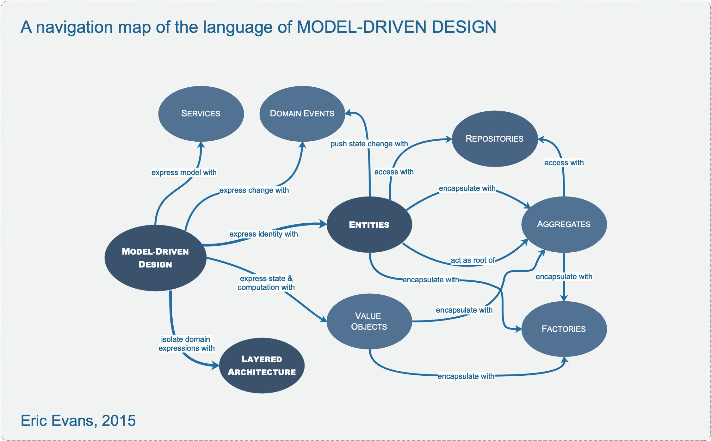

# **II. Building Blocks of a Model-Driven Design**

These patterns cast widely held best practices of object-oriented design in the light of domain-driven design. They guide decisions to clarify the model and to keep the model and implementation aligned with each other, each reinforcing the other’s effectiveness. Careful crafting the details of individual model elements gives developers a steady platform from which to explore models and to keep them in close correspondence with the implementation.

## **Layered Architecture**

In an object-oriented program, UI, database, and other support code often gets written directly into the business objects. Additional business logic is embedded in the behavior of UI widgets and database scripts. This happens because it is the easiest way to make things work, in the short run.

When the domain-related code is diffused through such a large amount of other code, it becomes extremely difficult to see and to reason about. Superficial changes to the UI can actually change business logic. To change a business rule may require meticulous tracing of UI code, database code, or other program elements. Implementing coherent, model-driven objects becomes impractical. Automated testing is awkward. With all the technologies and logic involved in each activity, a program must be kept very simple or it becomes impossible to understand.

**_Therefore:_**

**Isolate the expression of the domain model and the business logic, and eliminate any dependency on infrastructure, user interface, or even application logic that is not business logic. Partition a complex program into layers. Develop a design within each layer that is cohesive and that depends only on the layers below. Follow standard architectural patterns to provide loose coupling to the layers above. Concentrate all the code related to the domain model in one layer and isolate it from the user interface, application, and infrastructure code. The domain objects, free of the responsibility of displaying themselves, storing themselves, managing application tasks, and so forth, can be focused on expressing the domain model. This allows a model to evolve to be rich enough and clear enough to capture essential business knowledge and put it to work.**

The key goal here is isolation. Related patterns, such as “Hexagonal Architecture” may serve as well or better to the degree that they allow our domain model expressions to avoid dependencies on and references to other system concerns.

---

## **Entities**

Many objects represent a thread of continuity and identity, going through a lifecycle, though their attributes may change.

Some objects are not defined primarily by their attributes. They represent a thread of identity that runs through time and often across distinct representations. Sometimes such an object must be matched with another object even though attributes differ. An object must be distinguished from other objects even though they might have the same attributes. Mistaken identity can lead to data corruption.

**_Therefore:_**

**When an object is distinguished by its identity, rather than its attributes, make this primary to its definition in the model. Keep the class definition simple and focused on life cycle continuity and identity.**

**Define a means of distinguishing each object regardless of its form or history. Be alert to requirements that call for matching objects by attributes. Define an operation that is guaranteed to produce a unique result for each object, possibly by attaching a symbol that is guaranteed unique. This means of identification may come from the outside, or it may be an arbitrary identifier created by and for the system, but it must correspond to the identity distinctions in the model.**

**The model must define what it means to be the same thing.**

(aka Reference Objects)

---

## **Value Objects**

Some objects describe or compute some characteristic of a thing.

Many objects have no conceptual identity.

Tracking the identity of entities is essential, but attaching identity to other objects can hurt system performance, add analytical work, and muddle the model by making all objects look the same. Software design is a constant battle with complexity. We must make distinctions so that special handling is applied only where necessary.

However, if we think of this category of object as just the absence of identity, we haven’t added much to our toolbox or vocabulary. In fact, these objects have characteristics of their own, and their own significance to the model. These are the objects that describe things.

**_Therefore:_**

**When you care only about the attributes and logic of an element of the model, classify it as a value object. Make it express the meaning of the attributes it conveys and give it related functionality. Treat the value object as immutable. Make all operations Side-effect-free Functions that don’t depend on any mutable state. Don’t give a value object any identity and avoid the design complexities necessary to maintain entities.**

---

## **Domain Events \***

Something happened that domain experts care about.

An entity is responsible for tracking its state and the rules regulating its lifecycle. But if you need to know the actual causes of the state changes, this is typically not explicit, and it may be difficult to explain how the system got the way it is. Audit trails can allow tracing, but are not usually suited to being used for the logic of the program itself. Change histories of entities can allow access to previous states, but ignores the meaning of those changes, so that any manipulation of the information is procedural, and often pushed out of the domain layer.

A distinct, though related set of issues arises in distributed systems. The state of a distributed system cannot be kept completely consistent at all times. We keep the aggregates internally consistent at all times, while making other changes asynchronously. As changes propagate across nodes of a network, it can be difficult to resolve multiple updates arriving out of order or from distinct sources.

**_Therefore:_**

**Model information about activity in the domain as a series of discrete events. Represent each event as a domain object. These are distinct from system events that reflect activity within the software itself, although often a system event is associated with a domain event, either as part of a response to the domain event or as a way of carrying information about the domain event into the system.**

**A domain event is a full-fledged part of the domain model, a representation of something that happened in the domain. Ignore irrelevant domain activity while making explicit the events that the domain experts want to track or be notified of, or which are associated with state change in the other model objects.**

In a distributed system, the state of an entity can be inferred from the domain events currently known to a particular node, allowing a coherent model in the absence of full information about the system as a whole.

Domain events are ordinarily immutable, as they are a record of something in the past. In addition to a description of the event, a domain event typically contains a timestamp for the time the event occurred and the identity of entities involved in the event. Also, a domain event often has a separate timestamp indicating when the event was entered into the system and the identity of the person who entered it. When useful, an identity for the domain event can be based on some set of these properties. So, for example, if two instances of the same event arrive at a node they can be recognized as the same.

---

## **Services**

Sometimes, it just isn’t a thing.

Some concepts from the domain aren’t natural to model as objects. Forcing the required domain functionality to be the responsibility of an entity or value either distorts the definition of a model-based object or adds meaningless artificial objects.

**_Therefore:_**

**When a significant process or transformation in the domain is not a natural responsibility of an entity or value object, add an operation to the model as a standalone interface declared as a service. Define a service contract, a set of assertions about interactions with the service. (See assertions.) State these assertions in the ubiquitous language of a specific bounded context. Give the service a name, which also becomes part of the ubiquitous language.**

---

## **Modules**

Everyone uses modules, but few treat them as a full-fledged part of the model. Code gets broken down into all sorts of categories, from aspects of the technical architecture to developers’ work assignments. Even developers who refactor a lot tend to content themselves with modules conceived early in the project.

Explanations of coupling and cohesion tend to make them sound like technical metrics, to be judged mechanically based on the distributions of associations and interactions. Yet _it isn’t just code being divided into modules, but also concepts_. There is a limit to how many things a person can think about at once (hence low coupling). Incoherent fragments of ideas are as hard to understand as an undifferentiated soup of ideas (hence high cohesion).

**_Therefore:_**

**Choose modules that tell the story of the system and contain a cohesive set of concepts. Give the modules names that become part of the ubiquitous language. Modules are part of the model and their names should reflect insight into the domain.**

**This often yields low coupling between modules, but if it doesn’t look for a way to change the model to disentangle the concepts, or an overlooked concept that might be the basis of a module that would bring the elements together in a meaningful way. Seek low coupling in the sense of concepts that can be understood and reasoned about independently. Refine the model until it partitions according to high-level domain concepts and the corresponding code is decoupled as well.**

(aka Packages)

---

## **Aggregates**

It is difficult to guarantee the consistency of changes to objects in a model with complex associations. Objects are supposed to maintain their own internal consistent state, but they can be blindsided by changes in other objects that are conceptually constituent parts. Cautious database locking schemes cause multiple users to interfere pointlessly with each other and can make a system unusable. Similar issues arise when distributing objects among multiple servers, or designing asynchronous transactions.

**_Therefore:_**

**Cluster the entities and value objects into aggregates and define boundaries around each. Choose one entity to be the root of each aggregate, and allow external objects to hold references to the root only (references to internal members passed out for use within a single operation only). Define properties and invariants for the aggregate as a whole and give enforcement responsibility to the root or some designated framework mechanism.**

Use the same aggregate boundaries to govern transactions and distribution.

Within an aggregate boundary, apply consistency rules synchronously. Across boundaries, handle updates asynchronously.

Keep an aggregate together on one server. Allow different aggregates to be distributed among nodes.

When these design decisions are not being guided well by the aggregate boundaries, reconsider the model. Is the domain scenario hinting at an important new insight? Such changes often improve the model’s expressiveness and flexibility as well as resolving the transactional and distributional issues.

---

## **Repositories**

_Query access to aggregates expressed in the ubiquitous language._

Proliferation of traversable associations used only for finding things muddles the model. In mature models, queries often express domain concepts. Yet queries can cause problems.

The sheer technical complexity of applying most database access infrastructure quickly swamps the client code, which leads developers to dumb-down the domain layer, which makes the model irrelevant.
A query framework may encapsulate most of that technical complexity, enabling developers to pull the exact data they need from the database in a more automated or declarative way, but that only solves part of the problem.

Unconstrained queries may pull specific fields from objects, breaching encapsulation, or instantiate a few specific objects from the interior of an aggregate, blindsiding the aggregate root and making it impossible for these objects to enforce the rules of the domain model. Domain logic moves into queries and application layer code, and the entities and value objects become mere data containers.

**_Therefore:_**

**For each type of aggregate that needs global access, create a service that can provide the illusion of an in-memory collection of all objects of that aggregate’s root type. Set up access through a well-known global interface. Provide methods to add and remove objects, which will encapsulate the actual insertion or removal of data in the data store. Provide methods that select objects based on criteria meaningful to domain experts. Return fully instantiated objects or collections of objects whose attribute values meet the criteria, thereby encapsulating the actual storage and query technology, or return proxies that give the illusion of fully instantiated aggregates in a lazy way. Provide repositories only for aggregate roots that actually need direct access. Keep application logic focused on the model, delegating all object storage and access to the repositories.**

---

## **Factories**

When creation of an entire, internally consistent aggregate, or a large value object, becomes complicated or reveals too much of the internal structure, factories provide encapsulation.

Creation of an object can be a major operation in itself, but complex assembly operations do not fit the responsibility of the created objects. Combining such responsibilities can produce ungainly designs that are hard to understand. Making the client direct construction muddies the design of the client, breaches encapsulation of the assembled object or aggregate, and overly couples the client to the implementation of the created object.

**_Therefore:_**

**Shift the responsibility for creating instances of complex objects and aggregates to a separate object, which may itself have no responsibility in the domain model but is still part of the domain design. Provide an interface that encapsulates all complex assembly and that does not require the client to reference the concrete classes of the objects being instantiated. Create an entire aggregate as a piece, enforcing its invariants. Create a complex value object as a piece, possibly after assembling the elements with a builder.**
