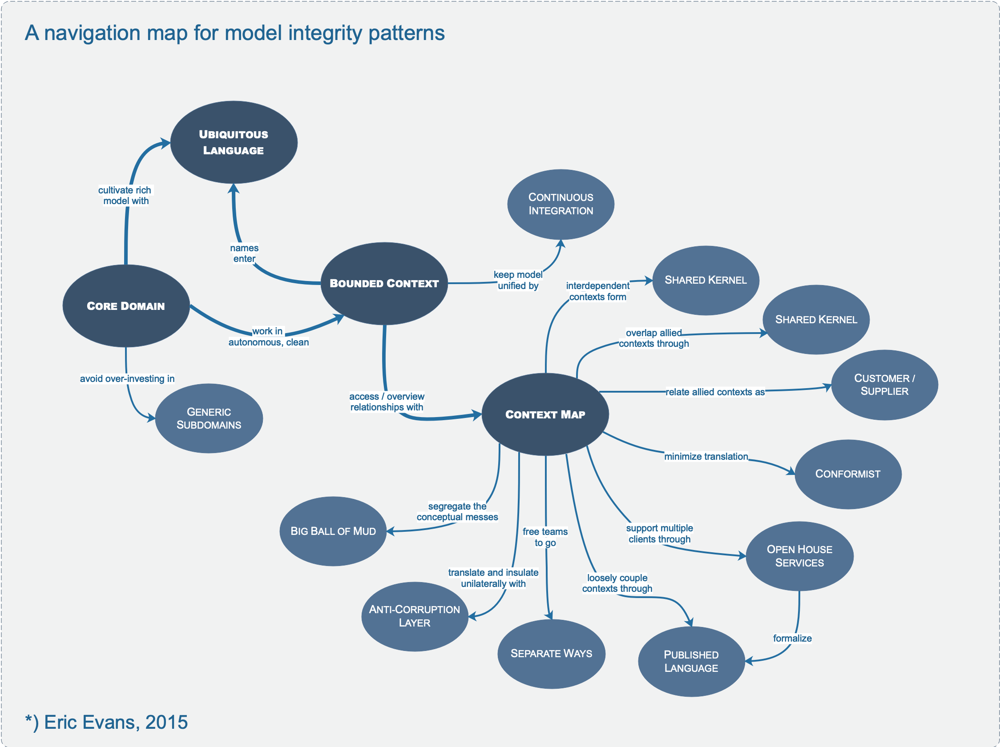

# **IV. Context Mapping for Strategic Design**

## **Definitions**

### **bounded context**

A description of a boundary (typically a subsystem, or the work of a particular team) within which a particular model is defined and applicable.

### **upstream-downstream**

A relationship between two groups in which the “upstream” group’s actions affect project success of the “downstream” group, but the actions of the downstream do not significantly affect projects upstream. (e.g. If two cities are along the same river, the upstream city’s pollution primarily affects the downstream city.)
The upstream team may succeed independently of the fate of the downstream team.

### **mutually dependent**

A situation in which two software development projects in separate contexts must both be delivered in order for either to be considered a success. (When two systems each rely on information or functionality of the other - something we would generally try to avoid - naturally we see the projects that build them as interdependent. Yet there are also mutually dependent projects where system dependencies run only one direction. When the depended-on system has little value without the dependent system and the integration with that system -perhaps because this is the only place it is used - then a failure to deliver the dependent system would be a failure of both projects.)

### **free**

A software development context in which the direction, success or failure of development work in other contexts has little effect on delivery.

---

## **Context Map**

To plot strategy, we need a realistic, large-scale view of model development extending across our project and others we integrate with.

An individual bounded context leaves some problems in the absence of a global view. The context of other models may still be vague and in flux.

People on other teams won’t be very aware of the context boundaries and will unknowingly make changes that blur the edges or complicate the interconnections. When connections must be made between different contexts, they tend to bleed into each other.

Even when boundaries are clear, relationships with other contexts place constraints on the nature of model or pace of change that is feasible. These constraints manifest themselves primarily through non-technical channels that are sometimes hard to relate to the design decisions they are affecting.

**_Therefore:_**

**Identify each model in play on the project and define its bounded context. This includes the implicit models of non-object-oriented subsystems. Name each bounded context, and make the names part of the ubiquitous language.**

**Describe the points of contact between the models, outlining explicit translation for any communication, highlighting any sharing, isolation mechanisms, and levels of influence.**

**Map the existing terrain. Take up transformations later.**

This map can be a basis for realistic design strategy.

The characterization of relationships is made more concrete in the following pages, with a set of common patterns of relationships between bounded contexts.

---

## **Partnership \***

_When teams in two contexts will succeed or fail together, a cooperative relationship often emerges._

Poor coordination of mutually dependent subsystems in separate contexts leads to delivery failure for both projects. A key feature missing from one system might make the other system undeliverable. Interfaces that do not match the expectations of the developers of the other subsystem could cause integration to fail. A mutually agreed interface might turn out to be so awkward to use that it slows the development of the client system, or so difficult to implement that it slows the development of the server subsystem. Failure brings both projects down.

**_Therefore:_**

**Where development failure in either of two contexts would result in delivery failure for both, forge a partnership between the teams in charge of the two contexts. Institute a process for coordinated planning of development and joint management of integration.**

**The teams must cooperate on the evolution of their interfaces to accommodate the development needs of both systems. Interdependent features should be scheduled so that they are completed for the same release.**

It is not necessary, most of the time, for developers to understand the model of the other subsystem in detail, but they must coordinate their project planning. When development in one context hits obstacles, then joint examination of the issue is called for, to find an expeditious design solution that does not overly compromise either context.

Also, a clear process is needed to govern integration. For example, a special test suite can be defined that proves the interface meets the expectations of the client system, which can be run as part of continuous integration on the server system.

---

## **Shared Kernel**

_Sharing a part of the model and associated code is a very intimate interdependency, which can leverage design work or undermine it._

When functional integration is limited, the overhead of continuous integration of a large context may be deemed too high. This may especially be true when the team does not have the skill or the political organization to maintain continuous integration, or when a single team is simply too big and unwieldy. So separate bounded contexts might be defined and multiple teams formed.

Once separate, uncoordinated teams working on closely related applications can go racing forward for a while, but what they produce may not fit together. Even partner teams can end up spending a great deal on translation layers and retrofitting, meanwhile duplicating effort and losing the benefits of a common ubiquitous language.

**_Therefore:_**

**Designate with an explicit boundary some subset of the domain model that the teams agree to share. Keep this kernel small.**

**Within this boundary, include, along with this subset of the model, the subset of code or of the database design associated with that part of the model. This explicitly shared stuff has special status, and shouldn’t be changed without consultation with the other team.**

Define a continuous integration process that will keep the kernel model tight and align the ubiquitous language of the teams. Integrate a functional system frequently, though somewhat less often than the pace of continuous integration within the teams.

---

## **Customer/Supplier Development**

_When two teams are in an upstream-downstream relationship, where the upstream team may succeed independently of the fate of the downstream team, the needs of the downstream come to be addressed in a variety of ways with a wide range of consequences._

A downstream team can be helpless, at the mercy of upstream priorities. Meanwhile, the upstream team may be inhibited, worried about breaking downstream systems. The problems of the downstream team are not improved by cumbersome change request procedures with complex approval processes. And the freewheeling development of the upstream team will stop if the downstream team has veto power over changes.

**_Therefore:_**

**Establish a clear customer/supplier relationship between the two teams, meaning downstream priorities factor into upstream planning. Negotiate and budget tasks for downstream requirements so that everyone understands the commitment and schedule.**

Agile teams can make the downstream team play the customer role to the upstream team, in planning sessions. Jointly developed automated acceptance tests can validate the expected interface from the upstream. Adding these tests to the upstream team’s test suite, to be run as part of its continuous integration, will free the upstream team to make changes without fear of side effects downstream.

---

## **Conformist**

When two development teams have an upstream/down-stream relationship in which the upstream has no motivation to provide for the downstream team’s needs, the downstream team is helpless. Altruism may motivate upstream developers to make promises, but they are unlikely to be fulfilled. Belief in those good intentions leads the downstream team to make plans based on features that will never be available. The downstream project will be delayed until the team ultimately learns to live with what it is given. An interface tailored to the needs of the downstream team is not in the cards.

**_Therefore:_**

**Eliminate the complexity of translation between bounded contexts by slavishly adhering to the model of the upstream team. Although this cramps the style of the downstream designers and probably does not yield the ideal model for the application, choosing conformity enormously simplifies integration. Also, you will share a ubiquitous language with your upstream team. The upstream is in the driver’s seat, so it is good to make communication easy for them. Altruism may be sufficient to get them to share information with you.**

---

## **Anticorruption Layer**

_Translation layers can be simple, even elegant, when bridging well-designed bounded contexts with cooperative teams. But when control or communication is not adequate to pull off a shared kernel, partner or customer/supplier relationship, translation becomes more complex. The translation layer takes on a more defensive tone._

A large interface with an upstream system can eventually overwhelm the intent of the downstream model altogether, causing it to be modified to resemble the other system’s model in an ad hoc fashion. The models of legacy systems are usually weak (if not big balls of mud), and even the exception that is clearly designed may not fit the needs of the current project, making it impractical to conform to the upstream model. Yet the integration may be very valuable or even required for the downstream project.

**_Therefore:_**

**As a downstream client, create an isolating layer to provide your system with functionality of the upstream system in terms of your own domain model. This layer talks to the other system through its existing interface, requiring little or no modification to the other system. Internally, the layer translates in one or both directions as necessary between the two models.**

---

## **Open-host Service**

_Typically for each bounded context, you will define a translation layer for each component with which you have to integrate that is outside the context. Where integration is one-off, this approach of inserting a translation layer for each external system avoids corruption of the models with a minimum of cost. But when you find your subsystem in high demand, you may need a more flexible approach._

When a subsystem has to be integrated with many others, customizing a translator for each can bog down the team. There is more and more to maintain, and more and more to worry about when changes are made.

**_Therefore:_**

**Define a protocol that gives access to your subsystem as a set of services. Open the protocol so that all who need to integrate with you can use it. Enhance and expand the protocol to handle new integration requirements, except when a single team has idiosyncratic needs. Then, use a one-off translator to augment the protocol for that special case so that the shared protocol can stay simple and coherent.**

This places the provider of the service in the upstream position. Each client is downstream, and typically some of them will be conformist and some will build anticorruption layers. A context with an open host service might have any sort of relationship to contexts other than its clients.

---

## **Published Language**

_The translation between the models of two bounded contexts requires a common language._

Direct translation to and from the existing domain models may not be a good solution. Those models may be overly complex or poorly factored. They are probably undocumented. If one is used as a data interchange language, it essentially becomes frozen and cannot respond to new development needs.

**_Therefore:_**

**Use a well-documented shared language that can express the necessary domain information as a common medium of communication, translating as necessary into and out of that language.**

Many industries establish published languages in the form of data interchange standards. Project teams also develop their own for use within their organization.

Published language is often combined with open-host service.

---

## **Separate Ways**

We must be ruthless when it comes to defining requirements. If two sets of functionality have no significant relationship, they can be completely cut loose from each other.

Integration is always expensive, and sometimes the benefit is small.

**_Therefore:_**

**Declare a bounded context to have no connection to the others at all, allowing developers to find simple, specialized solutions within this small scope.**

---

## **Big Ball of Mud \***

As we survey existing software systems, trying to understand how distinct models are being applied within defined boundaries, we find parts of systems, often large ones, where models are mixed and boundaries are inconsistent.

It is easy to get bogged down in an attempt to describe the context boundaries of models in systems where there simply are no boundaries.

Well-defined context boundaries only emerge as a result of intellectual choices and social forces (even though the people creating the systems may not always have been consciously aware of these causes at the time). When these factors are absent, or disappear, multiple conceptual systems and mix together, making definitions and rules ambiguous or contradictory. The systems are made to work by contingent logic as features are added. Dependencies crisscross the software. Cause and effect become more and more difficult to trace. Eventually the software congeals into a big ball of mud.

The big ball of mud is actually quite practical for some situations (as described in the original article by Foote and Yoder), but it almost completely prevents the subtlety and precision needed for useful models.

**_Therefore:_**

**Draw a boundary around the entire mess and designate it a big ball of mud. Do not try to apply sophisticated modeling within this context. Be alert to the tendency for such systems to sprawl into other contexts.**

(see http://www.laputan.org/mud/mud.html. Brian Foote and Joseph Yoder)
