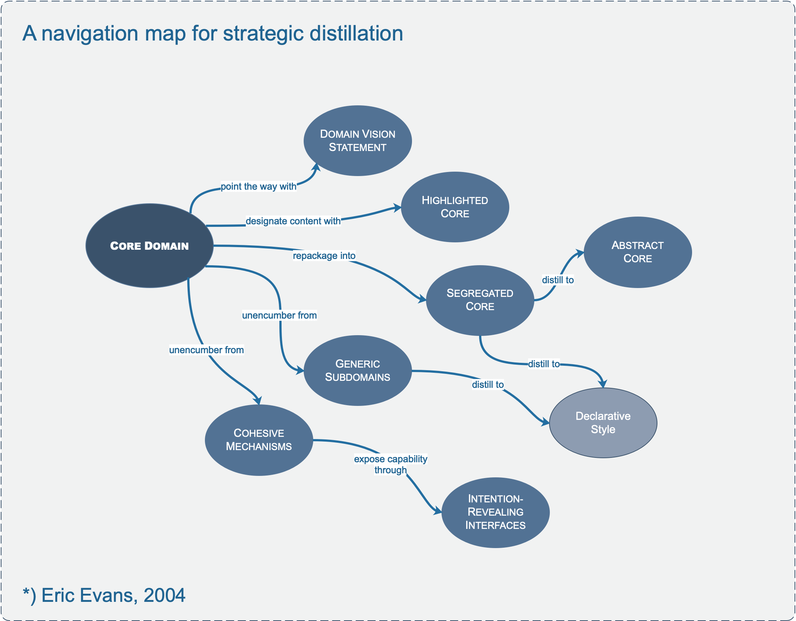

# **V. Distillation for Strategic Design**

How do you focus on your central problem and keep from drowning in a sea of side issues?

Distillation is the process of separating the components of a mixture to extract the essence in a form that makes it more valuable and useful. A model is a distillation of knowledge. With every refactoring to deeper insight, we abstract some crucial aspect of domain knowledge and priorities. Now, stepping back for a strategic view, this chapter looks at ways to distinguish broad swaths of the model and distill the domain model as a whole.

 

---

## **Core Domain**

In a large system, there are so many contributing components, all complicated and all absolutely necessary to success, that the essence of the domain model, the real business asset, can be obscured and neglected.

It is harsh reality that not all parts of the design are going to be equally refined. Priorities must be set. To make the domain model an asset, the critical core of that model has to be sleek and fully leveraged to create application functionality. But scarce, highly skilled developers tend to gravitate to technical infrastructure or neatly definable domain problems that can be understood without specialized domain knowledge.

**_Therefore:_**

**Boil the model down. Define a core domain and provide a means of easily distinguishing it from the mass of supporting model and code. Bring the most valuable and specialized concepts into sharp relief. Make the core small.**

**Apply top talent to the core domain, and recruit accordingly. Spend the effort in the core to find a deep model and develop a supple design—sufficient to fulfill the vision of the system.**

Justify investment in any other part by how it supports the distilled core.

---

## **Generic Subdomains**

Some parts of the model add complexity without capturing or communicating specialized knowledge. Anything extraneous makes the core domain harder to discern and understand. The model clogs up with general principles everyone knows or details that belong to specialties which are not your primary focus but play a supporting role. Yet, however generic, these other elements are essential to the functioning of the system and the full expression of the model.

**_Therefore:_**

**Identify cohesive subdomains that are not the motivation for your project. Factor out generic models of these subdomains and place them in separate modules. Leave no trace of your specialties in them.**

**Once they have been separated, give their continuing development lower priority than the core domain, and avoid assigning your core developers to the tasks (because they will gain little domain knowledge from them). Also consider off-the-shelf solutions or published models for these generic subdomains.**

---

## **Domain Vision Statement**

At the beginning of a project, the model usually doesn’t even exist, yet the need to focus its development is already there. In later stages of development, there is a need for an explanation of the value of the system that does not require an in-depth study of the model. Also, the critical aspects of the domain model may span multiple bounded contexts, but by definition these distinct models can’t be structured to show their common focus.

**_Therefore:_**

**Write a short description (about one page) of the core domain and the value it will bring, the “value proposition.” Ignore those aspects that do not distinguish this domain model from others. Show how the domain model serves and balances diverse interests. Keep it narrow. Write this statement early and revise it as you gain new insight.**

---

## **Highlighted Core**

A domain vision statement identifies the core domain in broad terms, but it leaves the identification of the specific core model elements up to the vagaries of individual interpretation. Unless there is an exceptionally high level of communication on the team, the vision statement alone will have little impact.

Even though team members may know broadly what constitutes the core domain, different people won’t pick out quite the same elements, and even the same person won’t be consistent from one day to the next. The mental labor of constantly filtering the model to identify the key parts absorbs concentration better spent on design thinking, and it requires comprehensive knowledge of the model. The core domain must be made easier to see.

Significant structural changes to the code are the ideal way of identifying the core domain, but they are not always practical in the short term. In fact, such major code changes are difficult to undertake without the very view the team is lacking.

**_Therefore (as one form of highlighted core):_**

**Write a very brief document (three to seven sparse pages) that describes the core domain and the primary interactions among core elements.**

and/or (as another form of highlighted core):

**Flag the elements of the core domain within the primary repository of the model, without particularly trying to elucidate its role. Make it effortless for a developer to know what is in or out of the core.**

If the distillation document outlines the essentials of the core domain, then it serves as a practical indicator of the significance of a model change. When a model or code change affects the distillation document, it requires consultation with other team members. When the change is made, it requires immediate notification of all team members, and the dissemination of a new version of the document. Changes outside the core or to details not included in the distillation document can be integrated without consultation or notification and will be encountered by other members in the course of their work. Then the developers have the full autonomy that most Agile processes suggest.

Although the vision statement and highlighted core inform and guide, they do not actually modify the model or the code itself. Partitioning generic subdomains physically removes some distracting elements. Next we’ll look at other ways to structurally change the model and the design itself to make the core domain more visible and manageable. . . .

---

## **Cohesive Mechanisms**

Computations sometimes reach a level of complexity that begins to bloat the design. The conceptual “what” is swamped by the mechanistic “how.” A large number of methods that provide algorithms for resolving the problem obscure the methods that express the problem.

**_Therefore:_**

**Partition a conceptually cohesive mechanism into a separate lightweight framework. Particularly watch for formalisms or well-documented categories of algorithms. Expose the capabilities of the framework with an intention-revealing interface. Now the other elements of the domain can focus on expressing the problem (“what”), delegating the intricacies of the solution (“how”) to the framework.**

**Factoring out generic subdomains reduces clutter, and cohesive mechanisms serve to encapsulate complex operations. This leaves behind a more focused model, with fewer distractions that add no particular value to the way users conduct their activities. But you are unlikely ever to find good homes for everything in the domain model that is not core. The segregated core takes a direct approach to structurally marking off the core domain. . .**

---

## **Segregated Core**

Elements in the model may partially serve the core domain and partially play supporting roles. Core elements may be tightly coupled to generic ones. The conceptual cohesion of the core may not be strong or visible. All this clutter and entanglement chokes the core. Designers can’t clearly see the most important relationships, leading to a weak design.

**_Therefore:_**

**Refactor the model to separate the core concepts from supporting players (including ill- defined ones) and strengthen the cohesion of the core while reducing its coupling to other code. Factor all generic or supporting elements into other objects and place them into other packages, even if this means refactoring the model in ways that separate highly coupled elements.**

---

## **Abstract Core**

Even the core domain model usually has so much detail that communicating the big picture can be difficult.
When there is a lot of interaction between subdomains in separate modules, either many references will have to be created between modules, which defeats much of the value of the partitioning, or the interaction will have to be made indirect, which makes the model obscure.

**_Therefore:_**

**Identify the most fundamental differentiating concepts in the model and factor them into distinct classes, abstract classes, or interfaces. Design this abstract model so that it expresses most of the interaction between significant components. Place this abstract overall model in its own module, while the specialized, detailed implementation classes are left in their own modules defined by subdomain.**
