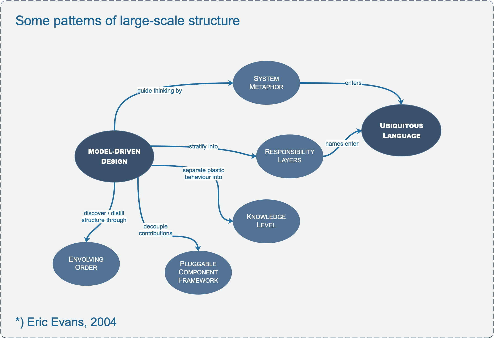

# **VI. Large-scale Structure for Strategic Design**

 

In a large system without any overarching principle that allows elements to be interpreted in terms of their role in patterns that span the whole design, developers cannot see the forest for the trees. We need to be able to understand the role of an individual part in the whole without delving into the details of the whole.

A “large-scale structure” is a language that lets you discuss and understand the system in broad strokes. A set of high-level concepts or rules, or both, establishes a pattern of design for an entire system. This organizing principle can guide design as well as aid understanding. It helps coordinate independent work because there is a shared concept of the big picture: how the roles of various parts shape the whole.

**_Therefore:_**

**Devise a pattern of rules or roles and relationships that will span the entire system and that allows some understanding of each part’s place in the whole—even without detailed knowledge of the part’s responsibility.**

---

## **Evolving Order**

Design free-for-alls produce systems no one can make sense of as a whole, and they are very difficult to maintain. But architectures can straitjacket a project with up-front design assumptions and take too much power away from the developers/designers of particular parts of the application. Soon, developers will dumb down the application to fit the structure, or they will subvert it and have no structure at all, bringing back the problems of uncoordinated development.

**_Therefore:_**

**Let this conceptual large-scale structure evolve with the application, possibly changing to a completely different type of structure along the way. Don’t over constrain the detailed design and model decisions that must be made with detailed knowledge.**

**Large-scale structure should be applied when a structure can be found that greatly clarifies the system without forcing unnatural constraints on model development. Because an ill- fitting structure is worse than none, it is best not to shoot for comprehensiveness, but rather to find a minimal set that solves the problems that have emerged. Less is more.**

**What follows is a set of four particular patterns of large-scale structure that emerge on some projects and are representative of this kind of pattern.**

---

## **System Metaphor**

Metaphorical thinking is pervasive in software development, especially with models. But the Extreme Programming practice of “metaphor” has come to mean a particular way of using a metaphor to bring order to the development of a whole system.

Software designs tend to be very abstract and hard to grasp. Developers and users alike need tangible ways to understand the system and share a view of the system as a whole.

**_Therefore:_**

**When a concrete analogy to the system emerges that captures the imagination of team members and seems to lead thinking in a useful direction, adopt it as a large-scale structure. Organize the design around this metaphor and absorb it into the ubiquitous language. The system metaphor should both facilitate communication about the system and guide development of it. This increases consistency in different parts of the system, potentially even across different bounded contexts. But because all metaphors are inexact, continually reexamine the metaphor for overextension or inaptness, and be ready to drop it if it gets in the way.**

---

## **Responsibility Layers**

In object-oriented design, individual objects are assigned narrow sets of related responsibilities. Responsibility-driven design also applies to larger scales.

When each individual object has handcrafted responsibilities, there are no guidelines, no uniformity, and no ability to handle large swaths of the domain together. To give coherence to a large model, it is useful to impose some structure on the assignment of those responsibilities.

**_Therefore:_**

**Look at the conceptual dependencies in your model and the varying rates and sources of change of different parts of your domain. If you identify natural strata in the domain, cast them as broad abstract responsibilities. These responsibilities should tell a story of the high-level purpose and design of your system. Refactor the model so that the responsibilities of each domain object, aggregate, and module fit neatly within the responsibility of one layer.**

---

## **Knowledge Level**

A group of objects that describe how another group of objects should behave.

In an application in which the roles and relationships between entities vary in different situations, complexity can explode. Neither fully general models nor highly customized ones serve the users’ needs. Objects end up with references to other types to cover a variety of cases, or with attributes that are used in different ways in different situations. Classes that have the same data and behavior may multiply just to accommodate different assembly rules.

**_Therefore:_**

**Create a distinct set of objects that can be used to describe and constrain the structure and behavior of the basic model. Keep these concerns separate as two “levels,” one very concrete, the other reflecting rules and knowledge that a user or super-user is able to customize.**

(see Fowler, M. 1997. Analysis Patterns: Reusable Object Models, Addison-Wesley.)

---

## **Pluggable Component Framework**

Opportunities arise in a very mature model that is deep and distilled. A pluggable component framework usually only comes into play after a few applications have already been implemented in the same domain.
When a variety of applications have to interoperate, all based on the same abstractions but designed independently, translations between multiple bounded contexts limit integration. A shared kernel is not feasible for teams that do not work closely together. Duplication and fragmentation raise costs of development and installation, and interoperability becomes very difficult.

**_Therefore:_**

**Distill an abstract core of interfaces and interactions and create a framework that allows diverse implementations of those interfaces to be freely substituted. Likewise, allow any application to use those components, so long as it operates strictly through the interfaces of the abstract core.**
