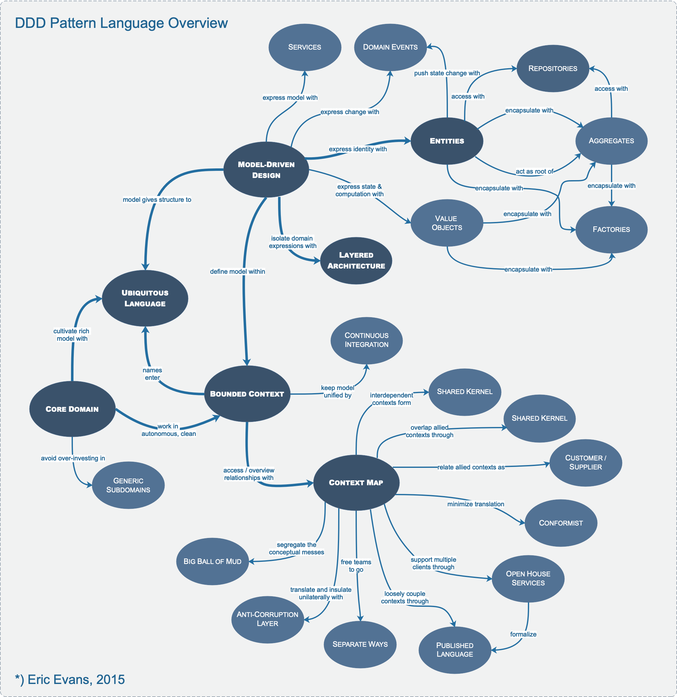

# **Welcome to Domain-Driven Design Reference**

Domain-Driven Design Reference Definitions and Pattern Summaries.

---

## **Overview**

**Domain-Driven Design** is an approach to the development of **_complex software_** in which we:

1.  Focus on the **_core domain_**.
2.  Explore models in a **_creative collaboration_** of **_domain practitioners_** and **_software practitioners_**.
3.  Speak a **_ubiquitous language_** within an explicitly **_bounded context_**.

## **Pattern Languange Overview**

## **Definitions**

#### **domain**

_A sphere of knowledge, influence, or activity. The subject area to which the user applies a program is the domain of the software._

#### **model**

_A system of abstractions that describes selected aspects of a domain and can be used to solve problems related to that domain._

#### **ubiquitous language**

_A language structured around the domain model and used by all team members within a bounded context to connect all the activities of the team with the software._

#### **context**

_The setting in which a word or statement appears that determines its meaning. Statements about a model can only be understood in a context._

#### **bounded context**

_A description of a boundary (typically a subsystem, or the work of a particular team) within which a particular model is defined and applicable._

### **References**

1. [Book] Domain-Driven Design Reference: Definitions and Pattern Summaries (Eric Evans, 2015). [ [eBook Link!](https://www.domainlanguage.com/product/domain-driven-design-reference/) ]

2. [Tools] zeljkoobrenovic's DDD Catalog Tools. [ [Tools Link!](https://www.zeljkoobrenovic.com/tools/catalogs/?id=ddd) ]
